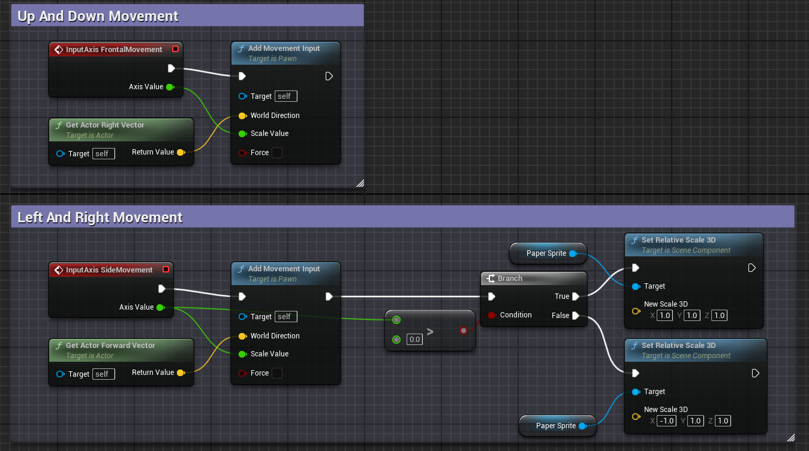
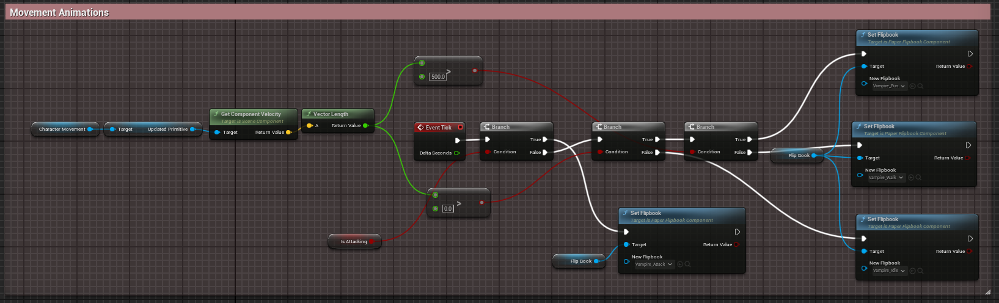
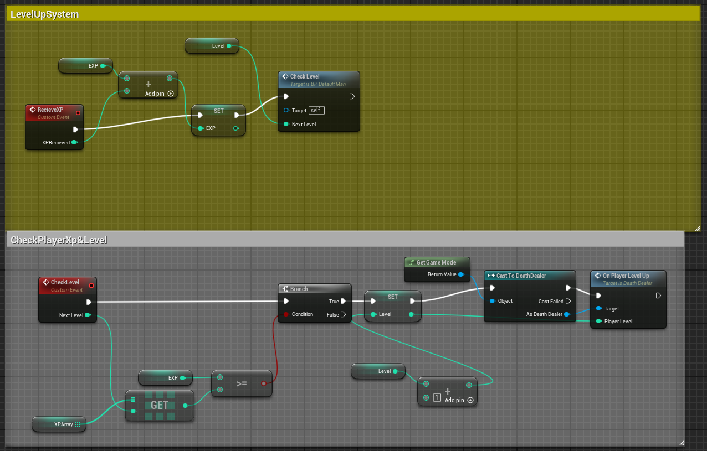
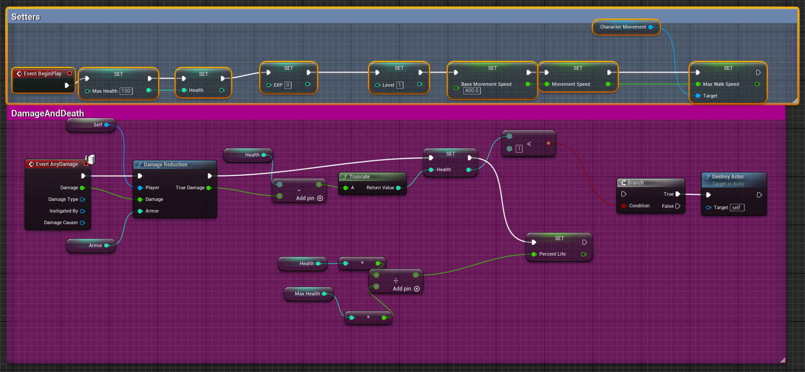
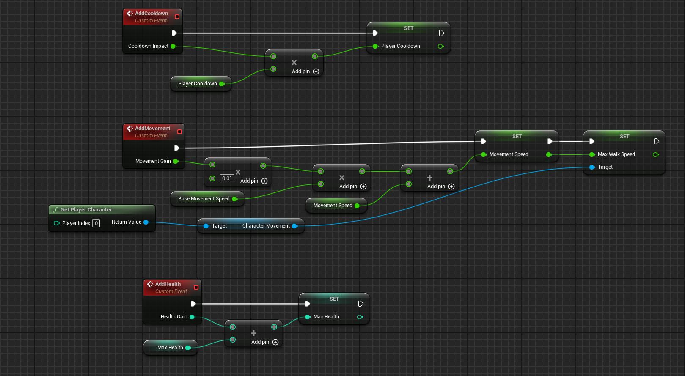

### **PROJECT DEATHDEALER**

## Description

The concept behind Project Deathdealer (a placeholder name) is to create a vampire survivor-like game with unique twists. I drew inspiration from a game called Median XL, a Diablo II mod that introduces challenging static boss content for solo players. This mod features specific character-altering attributes (e.g., changing ability functionalities) and custom loot tables. 
Typically, vampire survivor games focus on wave-based content with occasional bosses appearing after certain milestones, usually based on time. Project Deathdealer aims to innovate by offering an open-world experience where players can explore and, once they are strong enough, enter unique biome areas to challenge bosses. This approach effectively creates a hybrid genre, blending open-world exploration with the traditional vampire survivor mechanics.
## Features

- Unique mob types and wave sequences.
- 8 Different abilities all made with unique scaling in mind. (5 currently with VFX).
- Item drops with different raritys.

## Future Features
- Boss arenas that you can enter at will when you feel you are up to the challange.
- UI for the inventory system and item aquisition.
- New characters and enemy mob types.

## Portfolio Blueprint Review

Almost 85-90% of the project was done via blueprints and other unreal uassets. I will be going over most of the core fundamental blueprints that comprise of the game. There is also source C++ code that is generally used for custom structs and struct functionalties. 

## BLUEPRINT: BP_DefaultCharacter

This blueprint represents the player's character. Here we will be going over all the movement functionalities and animations + other getter/setter methods.

The blueprint below is for setting flip book animations based on the movement speed of the player at the current tick in time.

## BLUEPRINT: BP_BaseEnemy

This blueprint represents the player's character. Here we will be going over all the movement functionalities and animations + other getter/setter methods.
