### **PROJECT DEATHDEALER**

## Description

The concept behind Project Deathdealer (a placeholder name) is to create a vampire survivor-like game with unique twists. I drew inspiration from a game called Median XL, a Diablo II mod that introduces challenging static boss content for solo players. This mod features specific character-altering attributes (e.g., changing ability functionalities) and custom loot tables. 
Typically, vampire survivor games focus on wave-based content with occasional bosses appearing after certain milestones, usually based on time. Project Deathdealer aims to innovate by offering an open-world experience where players can explore and, once they are strong enough, enter unique biome areas to challenge bosses. This approach effectively creates a hybrid genre, blending open-world exploration with the traditional vampire survivor mechanics.
## Features

- Unique mob types and wave sequences.
- 8 Different abilities all made with unique scaling in mind. (5 currently with VFX).
- Item drops with different raritys.

## Future Features
- Boss arenas that you can enter at will when you feel you are up to the challange.
- UI for the inventory system and item aquisition.
- New characters and enemy mob types.

## Portfolio Blueprint Review

Almost 85-90% of the project was done via blueprints and other unreal uassets. I will be going over most of the core fundamental blueprints that comprise of the game. There is also source C++ code that is generally used for custom structs and struct functionalties. 

## BLUEPRINT: BP_DefaultCharacter

This blueprint represents the player's character. Here we will be going over all the movement functionalities and animations + other getter/setter methods.

The blueprint below is for setting flip book animations based on the movement speed of the player at the current tick in time.

Recieves XP from orb BP's that drop from enemies when their health reachs 0.
Also checks if a player XP has reached over a certain threshold.

Recives damage from any damage event caused by any BP_Base_Enemy.
Damaged reduction formula applies armor and flat damage reduction to the damage recieved and minused by the players HP.

A few setter events for Items and Passive bonused to inteact with.

## BLUEPRINT: BP_BaseEnemy

This blueprint represents a simple enemy type that uses the moveTo default AI operation and an attack function to hit the player when reaching a close proximity. 

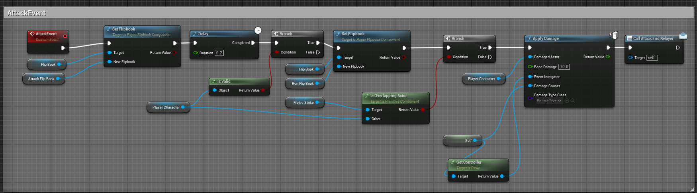

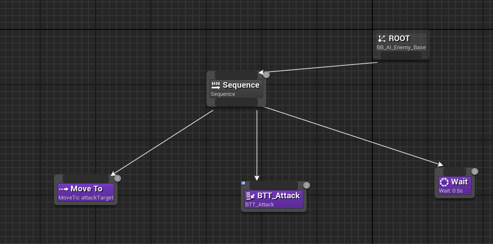

Checks the player's position compared to the enemies. If the player is to left set the rotation of the sprite to the left, and vise-versa. 

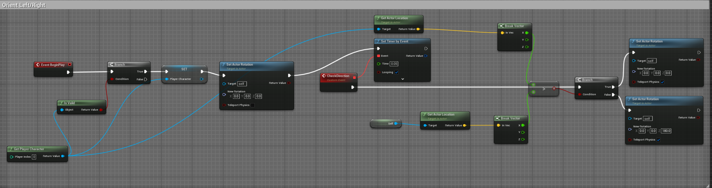

Currently just takes damage from player attacks/spells. No damage reduction formula is applied to enemies yet.

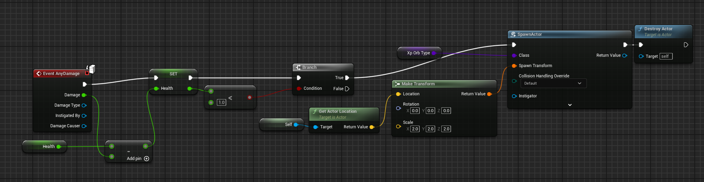

## BLUEPRINT: BP_DeathDealer

This blueprint represents the gamemode, and is reponsible for level up triggers, item triggers and spawning monster waves.

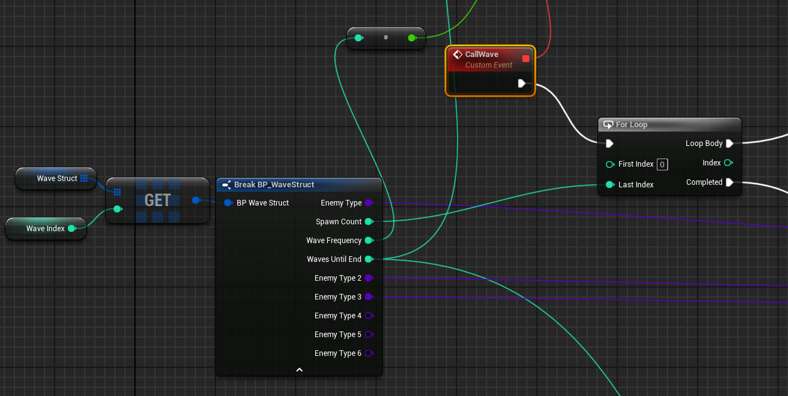

Using structs I was able to make waves have multiple enemy types based on classes, and then set certain parameters that control the wave functionality like "Wave Frequency".

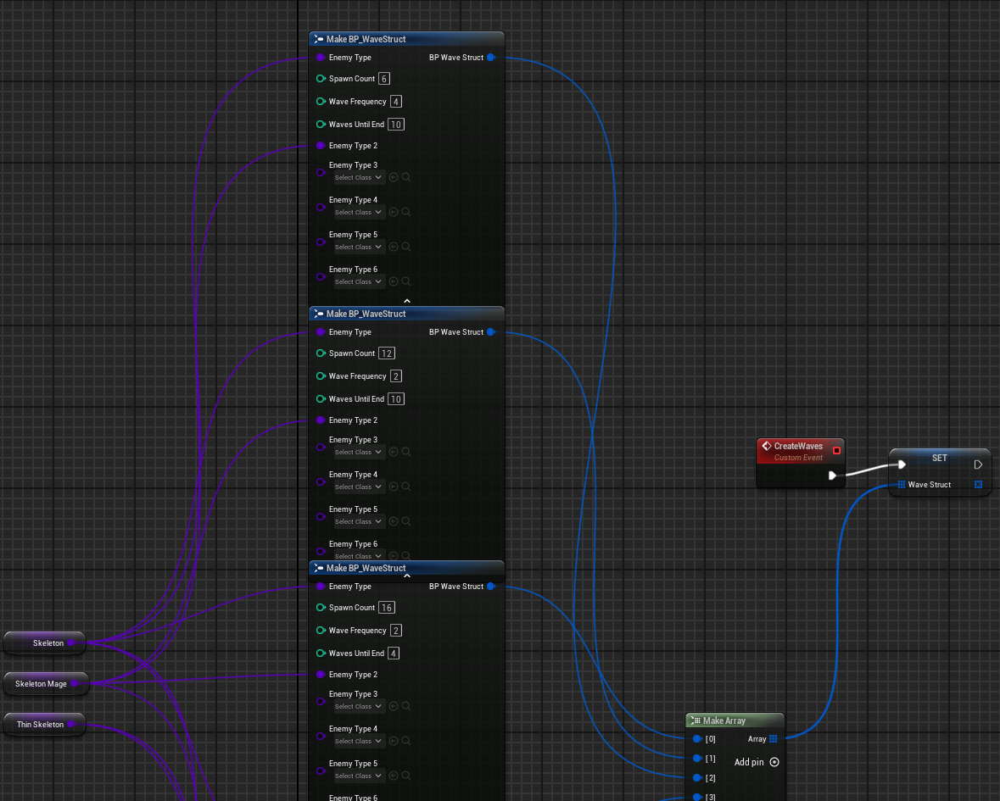

Initializing the games UI and other constants.

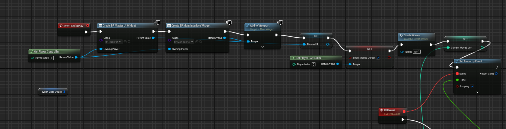

Spawning logic using a randomly generated vector in space and the players vector in space to create distances and positions of spawns.

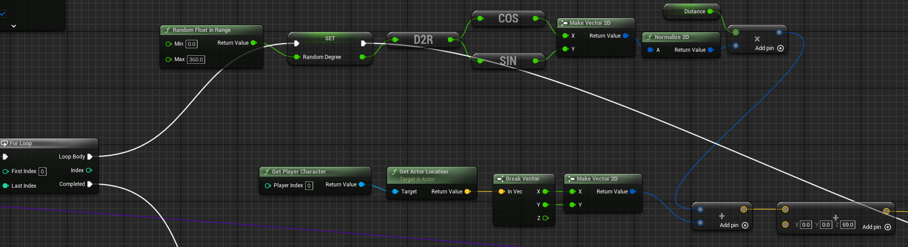

This is using custom structs built within C++, to choose a spell and or passive based on a given weighting.

Each time a passive or spell is selected the total weighting of that chance of occuring decreases by a certain amount. (Spell weight - a constant value), which can reach 0.

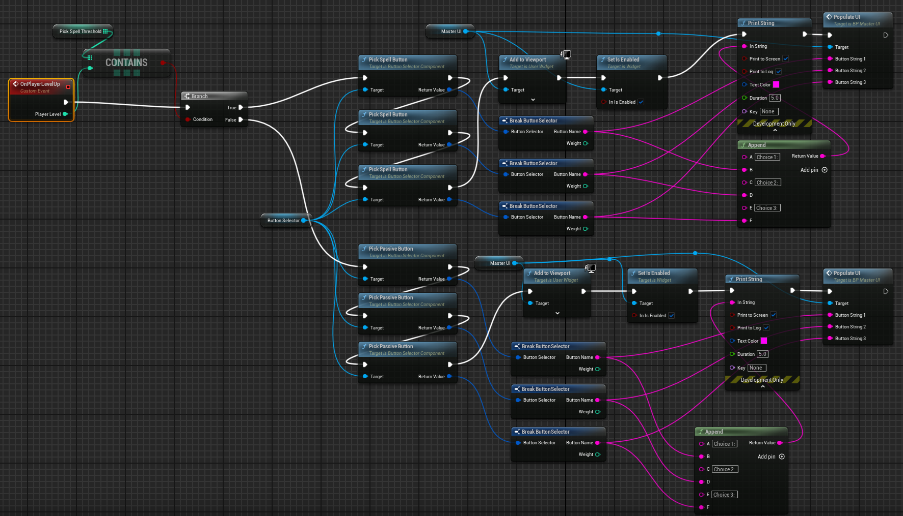

Decrements the wave which is used to call the next struct into action.

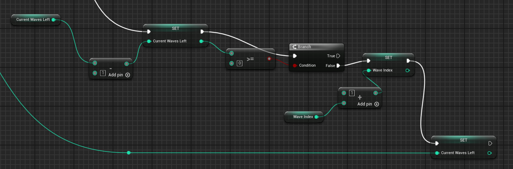

## BLUEPRINT: Spells_Folder

These images will represent some of the spells that are currently implemented in the game. Some of these still need hookups to gather play stats but in total work. (5 out of 8) of the current spells have VFX.

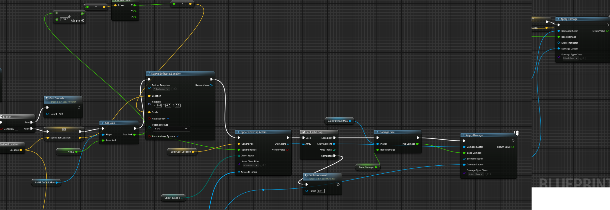

Shows the cooldown system and the initial variable hookups of the spell Flame Front.

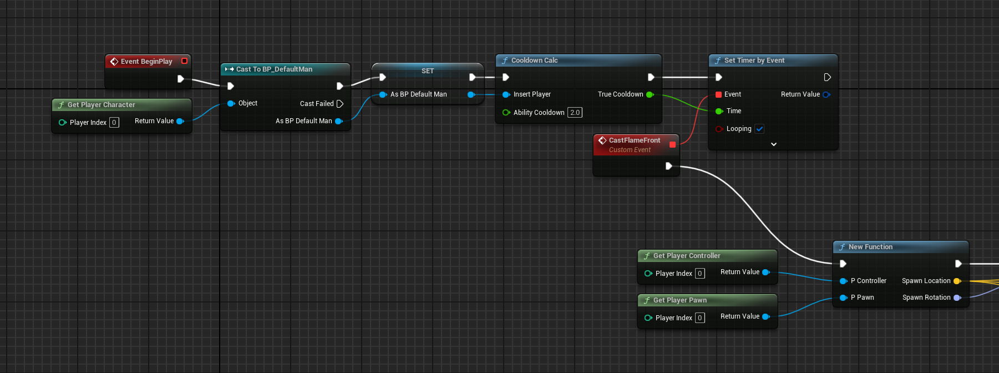

Get hit results essentially gathers mouse data and compares that vector to the players vector.

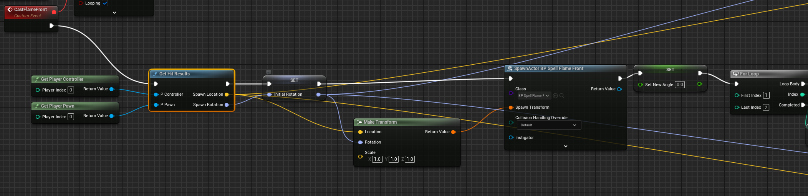

Shows the implementation of flame fronts greater multiple projects. Creates a fanning affect the more projects that are added. I will eventually make this into a function that can be accessed through all spells.

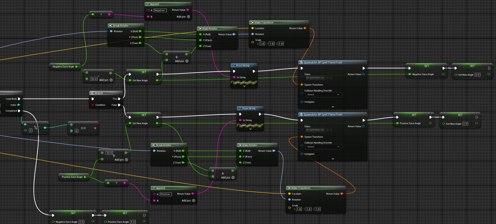

Start of the chain lightning spell. Very similar to flamefront.

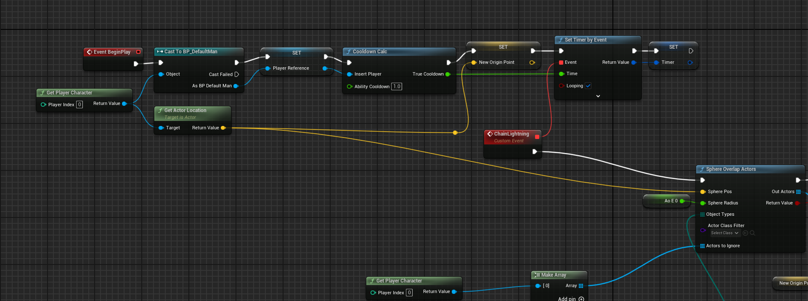

Shows how the cascading sphere calculates work, to gather the closest actor in the area.

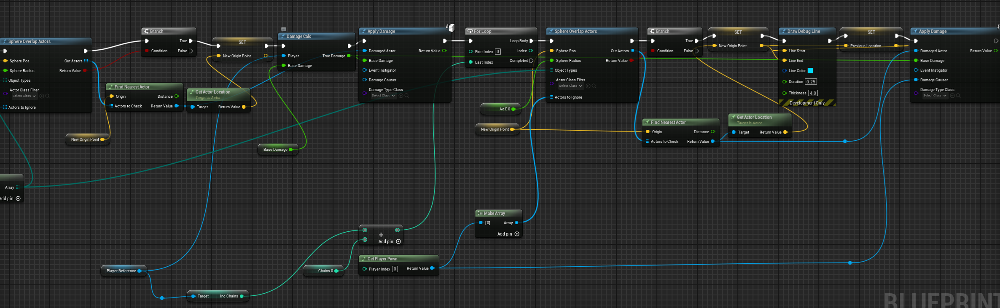

## BLUEPRINT: Spells_Passive_UI

These blueprint images are responsible for the UI to select spells or passives based on the players current level.

The image below shows the setup for passive buttons UI.

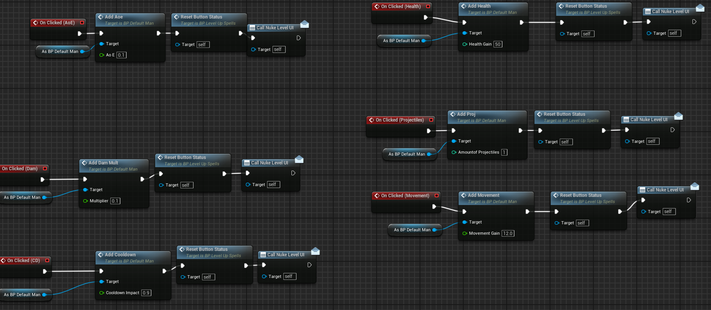

The image below shows the setup for spell buttons UI.
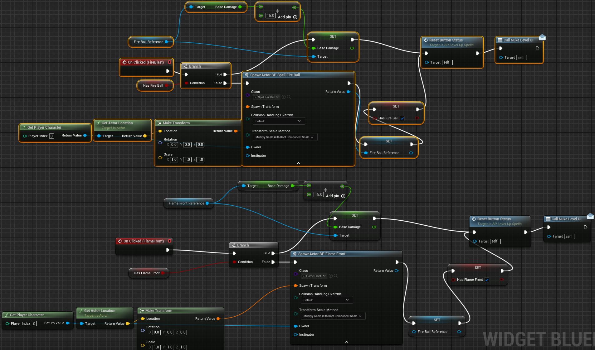

The master UI is used to populate and display the Spell and Passive UI widgets.

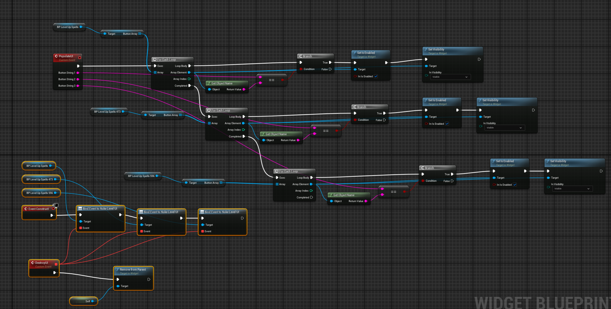

## BLUEPRINT (Still in the works): Items

THese blueprints and data tables are used in conjunction with C++ code to develop an item system. Items will first select rarity based on weights, then select an item from that rarity. These item names are then used to gather info from the Data Table and are served to the player, which then uses AddStat nodes based on the item equipped.

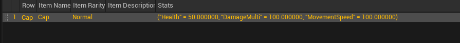

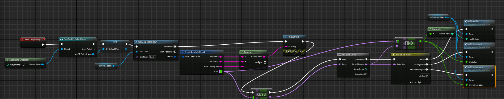

## Few Util functions for calculations

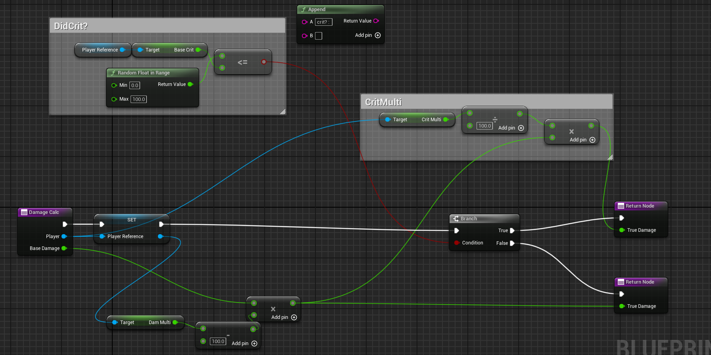

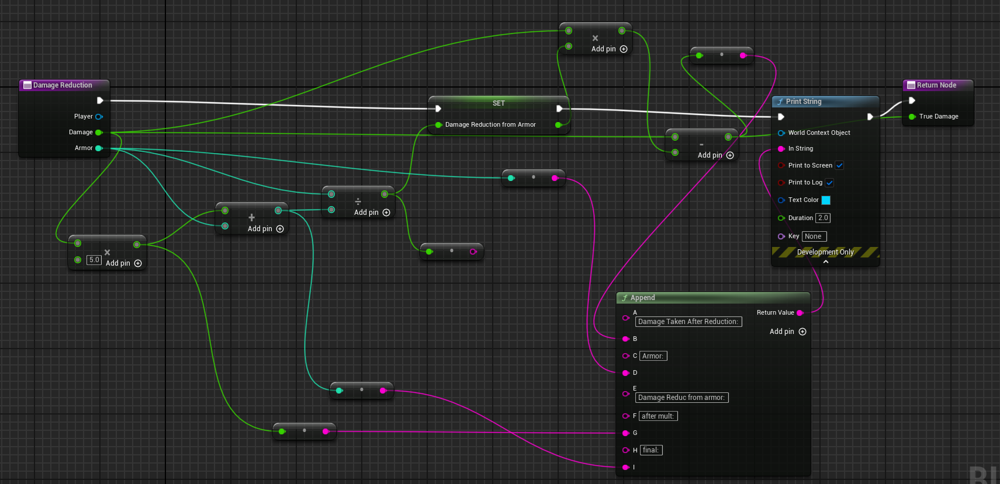

To see more about the items check the source code.

